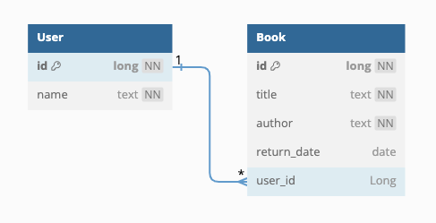

# Home Office Technical Test

## Introduction

This assessment is designed to evaluate your coding skills based on readability, maintainability, and testability. 
More than just arriving at the correct solution, we're interested in understanding your problem-solving approach.

## Pre-requisites before Interview

1. Clone the provided project.
2. Set up the project on your local machine and ensure it runs without issues.
3. Test the `/users` endpoint using tools like `Postman` or `curl` to confirm functionality.
4. Take some time to familiarise yourself with the existing solution and consider how you'd incorporate new features and test your solution.

## Technologies

The application is written in Java 17 using Spring Boot. It uses Gradle for dependency management and building.

## Database

The data structure is very simple. There are two tables called: `books` and `users`.

The full schema can be found in the [schema](src/main/resources/db/migration/V1__AddInitialSchema.sql) file.

Seed data is provided in the [data](src/main/resources/db/migration/R__SeedData.sql) file.
### Connecting to the database

The application uses a local in memory database.

You can connect to the database through the h2 console at http://localhost:8080/h2-console with the application running.

The connection details are:

| Property  | Value                 |
|-----------|-----------------------|
| JDBC URL  | jdbc:h2:mem:bookstore |
| User Name | sa                    |
| Password  | password              |
